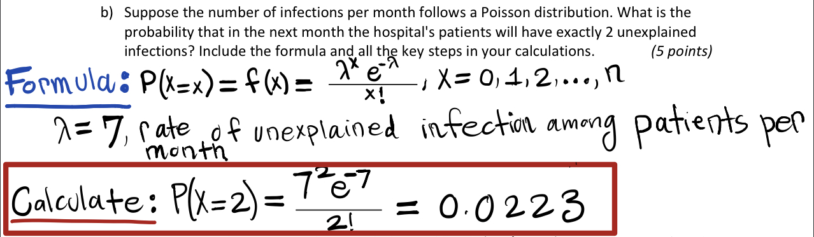
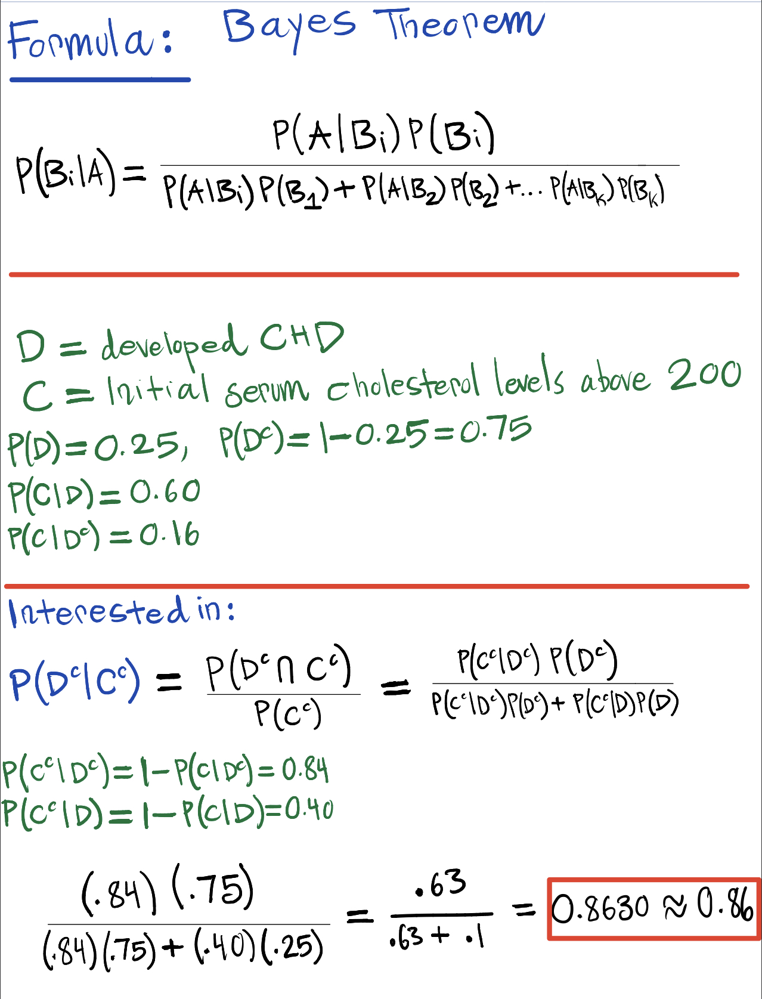
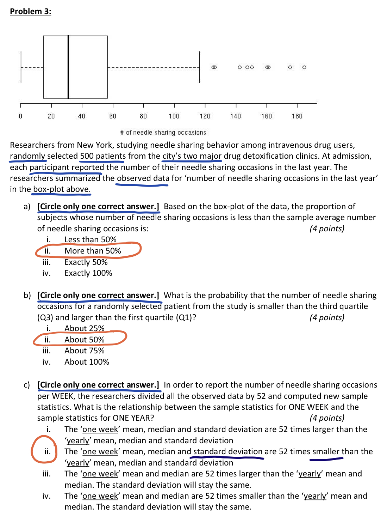
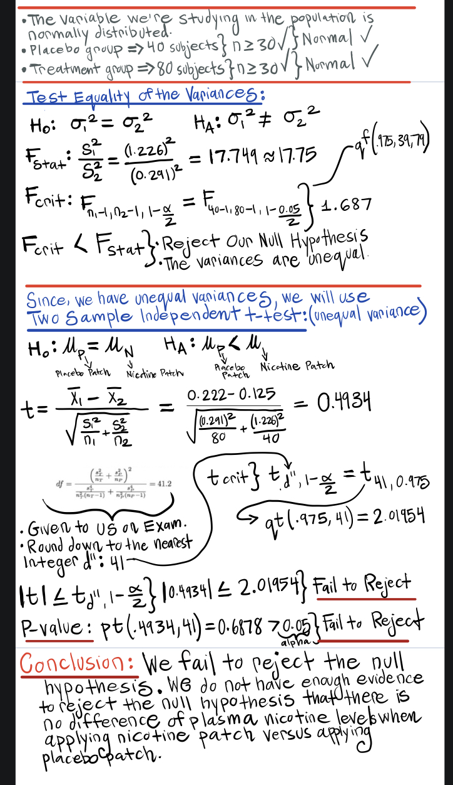
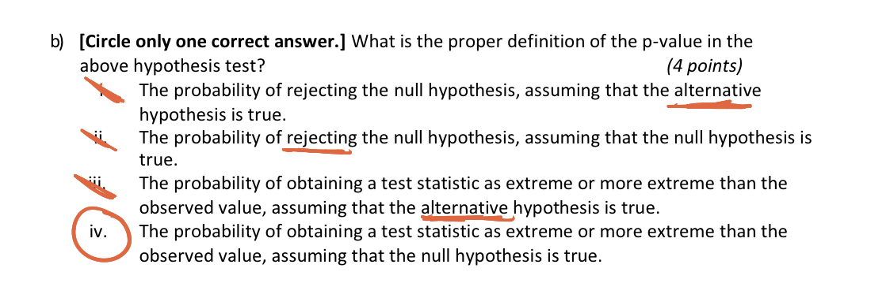

```{r setup, include=FALSE}
knitr::opts_chunk$set(echo = TRUE)
```

## **Problem 1**

**a).**
**Assumptions that must be true to use the Poisson Distribution to model the number of infections per month:**

1. Events occur one at a time; two or more events cannot occur exactly at the same time and location;

2. The occurrence of an event in a given period is independent of the occurrence of an event in a non-overlapping period;

3. The expected number of events during any period is constant.

**b).**
```{r echo=FALSE, fig.align="center", out.width = '100%'}

```

## We may use R code to get the same value. 
```{r}

prob = dpois(2, 7)
prob
```
*The probability that in the next month the hospital's patients will have exactly 2 unexplained infections is:* **`r prob`**. 

\newpage

## **Problem 2**
```{r  echo=FALSE, fig.align="center", out.width = '70%'}

```
*The probability that a random chosen subject will not develop CHD, given that he had an initial serum cholesterol level below or equal 200 is:* **0.86**. 


\newpage


## **Problem 3**
```{r  echo=FALSE, fig.align="center", out.width = '70%'}

```


\newpage

## **Problem 5a**
```{r  echo=FALSE, fig.align="center", out.width = '70%'}

```

\newpage

## **Problem 5b**
```{r  echo=FALSE, fig.align="center", out.width = '70%'}

```


