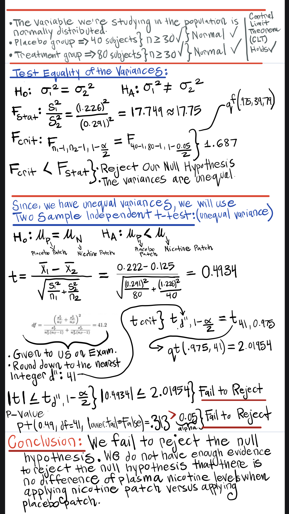

```{r setup, include=FALSE}
knitr::opts_chunk$set(echo = TRUE)
```

## **Problem 1**

**a).**
**Assumptions that must be true to use the Poisson Distribution to model the number of infections per month:**

1. Events occur one at a time; two or more events cannot occur exactly at the same time and location;

2. The occurrence of an event in a given period is independent of the occurrence of an event in a non-overlapping period;

3. The expected number of events during any period is constant.

**b).**
```{r echo=FALSE, fig.align="center", out.width = '100%'}

```

## We may use R code to get the same value. 
```{r}

prob = dpois(2, 7)
prob
```
*The probability that in the next month the hospital's patients will have exactly 2 unexplained infections is:* **`r prob`** *or 2.23%.*

\newpage

## **Problem 2**
```{r  echo=FALSE, fig.align="center", out.width = '70%'}
knitr::include_graphics("problem2.jpg")
```
*The probability that a random chosen subject will not develop CHD, given that he had an initial serum cholesterol level below or equal 200 is:* **0.8630** *or 86%*. 


\newpage


## **Problem 3**
```{r  echo=FALSE, fig.align="center", out.width = '70%'}

```


\newpage


## **Problem 4**
```{r  echo=FALSE, fig.align="center", out.width = '70%'}

```

## We also may use R code to get the value:
```{r}
binom_data = dbinom(4, 10, 0.5) + dbinom(6, 10, 0.5)
```
*A couple has 10 children and the probability of the event of having exactly 4 boys or exactly 6 boys or exactly 6 girls is:* **`r binom_data`** *or 41%.*

\newpage


## **Problem 5a**
```{r  echo=FALSE, fig.align="center", out.width = '50%'}

```


## **Problem 5b**
```{r  echo=FALSE, fig.align="center", out.width = '50%'}
knitr::include_graphics("problem5b.jpg")
```


\newpage


## **Problem 6**
```{r  echo=FALSE, fig.align="center", out.width = '60%'}

```


```{r  echo=FALSE, fig.align="center", out.width = '50%'}

```


\newpage

## **Problem 6d**
```{r  echo=FALSE, fig.align="center", out.width = '60%'}

```
**For problem 6d, we may use Z-table, or R code.** 
```{r}
ptsd_prob = 1-pnorm(45, mean = 42, sd = 7)
```

**Interpretation**: *The probability that the mean PTSD score in a sample of 40 soldiers is greater than 45 is `r ptsd_prob` or 33.4%*. 

\newpage


## **Problem 7a**
```{r  echo=FALSE, fig.align="center", out.width = '60%'}

```

## **Problem 7b**
```{r  echo=FALSE, fig.align="center", out.width = '60%'}

```


\newpage


## **Problem 8**

*For problem 8, I'll be using a **Chi-Squared:Test of Independence**. I chose to use this statistical test because the problem states we need to determine if there is association between the treatment group and dropout rates and we may use Chi-Squared: Test of Independence to test for independence or association of the rows and column variables. For this problem, I am interested if one variable's value provides any information about the value of the other variable, i.e. are the two variables independent or dependent/associated? Also the problem indicates to create "table of expected values" (contingency table) and we have learned these tables are created for Chi-Square test.*
```{r  echo=FALSE, fig.align="center", out.width = '40%'}

```

